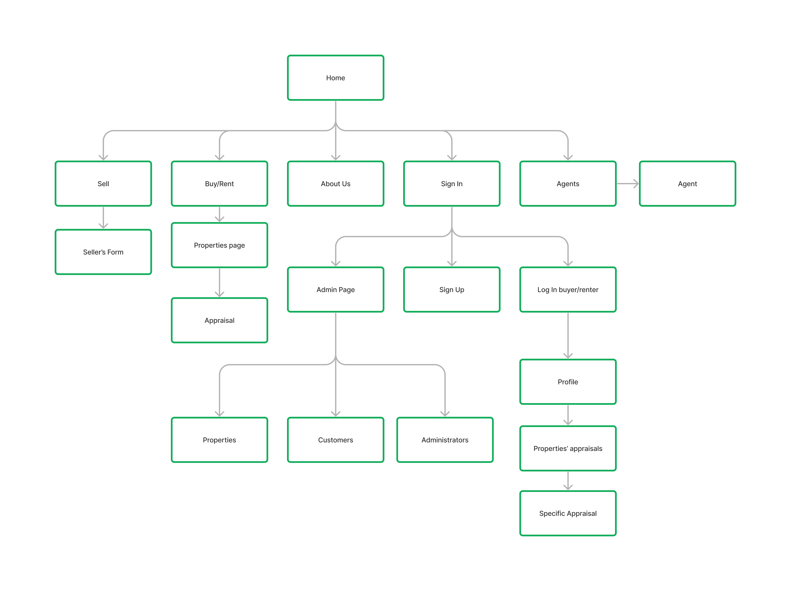

# ProjectRealState - Projeto de Corretora de Imoveis web

Este repositorio é destinado para o projeto desenvolvido na disciplina Introdução ao Desenvolvimento Web ministrada pelo professor Dilvan de Abreu Moreira. Para o desenvolvimento do projeto houve a participação dos alunos:

Andrey Cortez Rufino, nº usp
Daniel Arrais Martins, nº usp 11819445
Mateus de Souza Santos, nº usp 11366913

## Requisitos

Além dos requisitos expressos na descrição do projeto, temos:
O sistema deve permitir que o usuário consiga fazer busca de locações, utilizando filtros para obter melhores resultados.

## Descrição do Projeto
A Ousadia Imobiliária é uma empresa fictícia especializada em serviços de corretagem de imóveis. Oferecemos um amplo leque de serviços para nossos clientes que buscam alugar, comprar ou vender imóveis.
+ Aluguel de imóveis: A Ousadia Imobiliária possui uma ampla variedade de opções de propriedades para alugar, incluindo casas, apartamentos e imóveis comerciais. Nossos agentes imobiliários estão disponíveis para ajudá-lo a encontrar a opção perfeita para suas necessidades.

+ Venda de imóveis: Se você está procurando vender uma propriedade, a Ousadia Imobiliária pode ajudá-lo a encontrar o melhor preço para sua propriedade. Nossos agentes imobiliários possuem amplo conhecimento do mercado local e podem ajudá-lo a fechar um acordo justo e transparente.

+ Consulta com agentes imobiliários: Nossos agentes imobiliários são profissionais experientes e altamente qualificados que podem ajudá-lo em cada etapa do processo de corretagem. Eles estão disponíveis para responder a quaisquer perguntas que você possa ter e orientá-lo em suas decisões de compra, venda ou locação.

+ Perfil do usuário: Com a Ousadia Imobiliária, você pode criar um perfil de usuário para gerenciar suas pesquisas, favoritos e interações com nossos agentes imobiliários. Nossa plataforma é fácil de usar e intuitiva, garantindo que você possa encontrar o que procura com rapidez e facilidade.

+ Perfil do administrador: Nossos clientes também têm acesso a um perfil de administrador, que garante a eficiência e transparência em todas as nossas operações. Isso inclui a gestão de documentos e a comunicação com os clientes para garantir que todas as operações sejam executadas de maneira profissional e confiável.

+ Informações sobre a empresa: No site da Ousadia Imobiliária, você pode encontrar informações sobre nossa empresa, bem como nossos valores e missão. Queremos que nossos clientes saibam que podem confiar em nós para fornecer serviços de corretagem de imóveis de alta qualidade e éticos.
    
## Diagrama    
Aplicação se trata de uma aplicação web para uma imobiliária e conta com o seguinte diagrama de navagação:

Para visualizar o mockup das páginas basta acessar: https://www.figma.com/file/HTA8SPnrBmFxqan7vjvkvF/mockup?type=design&node-id=0%3A1&t=7yYNAlJD72id5u4C-1 

## Comentários sobre o código

## Plano de Teste

## Resultados de Teste

## Procedimento de Build

## Problemas 

## Comentários
